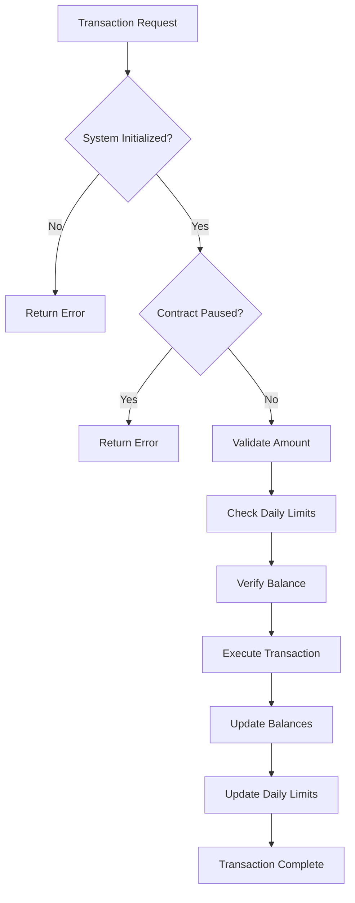
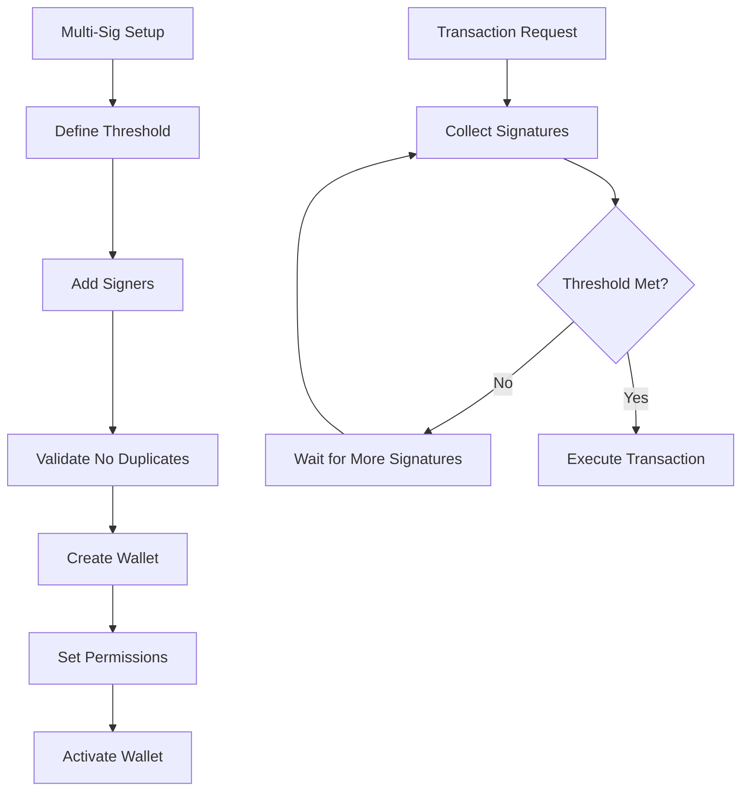
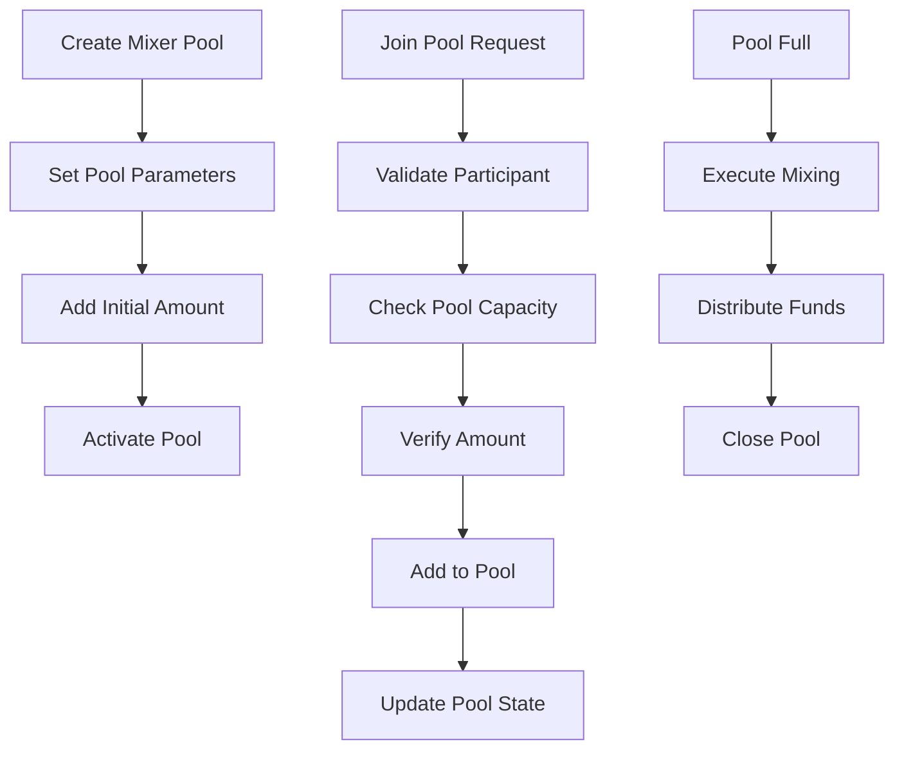

# BitShield Pro

## Advanced Bitcoin Custody Solution with Institutional-Grade Security

BitShield Pro is a comprehensive Bitcoin custody and transaction management platform built on the Stacks blockchain. It provides enterprise-level security through multi-signature workflows, privacy-preserving mixing protocols, and sophisticated access controls.

## 🚀 Key Features

- **Multi-Signature Security**: Customizable threshold-based transaction approval
- **Privacy-Enhanced Mixing**: Secure transaction mixing with participant pools
- **Time-Based Security**: Cooling periods and time-locked operations
- **Daily Transaction Limits**: Automatic limit enforcement with daily reset
- **Emergency Controls**: Pause/unpause functionality for security incidents
- **Comprehensive Auditing**: Full transaction validation and audit trails

## 🏗️ System Overview

BitShield Pro operates as a smart contract on the Stacks blockchain, providing a secure layer for Bitcoin custody operations. The system implements multiple security layers including multi-signature requirements, daily transaction limits, and cooling periods to ensure maximum security while maintaining operational efficiency.

### Core Components

```
┌─────────────────────────────────────────────────────────────┐
│                    BitShield Pro Platform                   │
├─────────────────────────────────────────────────────────────┤
│  Multi-Sig Wallets  │  Privacy Mixing  │  Access Controls   │
│  Transaction Limits  │  Balance Mgmt    │  Emergency System  │
├─────────────────────────────────────────────────────────────┤
│                    Stacks Blockchain                        │
├─────────────────────────────────────────────────────────────┤
│                    Bitcoin Network                          │
└─────────────────────────────────────────────────────────────┘
```

## 🏛️ Contract Architecture

### State Management

**Data Variables**

- `contract-owner`: Contract administrator
- `initialized`: System initialization status
- `contract-paused`: Emergency pause state
- `mixing-fee`: Transaction mixing fee percentage
- `min-mixer-amount`: Minimum amount for mixing operations

**Data Maps**

- `balances`: User balance tracking
- `daily-limits`: Daily transaction limit enforcement
- `mixer-pools`: Privacy mixing pool management
- `multi-sig-wallets`: Multi-signature wallet configurations
- `signer-permissions`: Authorization matrix for signers
- `pending-transactions`: Transaction queue and execution tracking

### Security Layers

```
┌─────────────────────────────────────────────────────────────┐
│                    Security Architecture                    │
├─────────────────────────────────────────────────────────────┤
│  Emergency Pause    │  Multi-Sig Auth  │  Daily Limits      │
├─────────────────────────────────────────────────────────────┤
│  Cooling Periods    │  Amount Limits   │  Duplicate Checks  │
├─────────────────────────────────────────────────────────────┤
│  Balance Validation │  Pool Validation │  Signer Validation │
└─────────────────────────────────────────────────────────────┘
```

## 🔄 Data Flow

### Transaction Processing Flow



### Multi-Signature Workflow



### Privacy Mixing Process



## 📊 Transaction Limits & Security

### Daily Transaction Limits

- **Maximum Daily Limit**: 1,000 BTC (100,000,000,000 sats)
- **Maximum Single Transaction**: 10,000 BTC (1,000,000,000,000 sats)
- **Automatic Reset**: Every 144 blocks (~24 hours)

### Security Timeframes

- **Cooling Period**: 144 blocks (~24 hours)
- **Multi-Sig Validation**: Real-time signature verification
- **Pool Participation**: Maximum 100 participants per pool

## 🔧 Core Functions

### Public Functions

**Transaction Management**

- `deposit(amount)`: Secure fund deposits with validation
- `withdraw(amount)`: Controlled fund withdrawals
- `initialize(threshold)`: System initialization

**Multi-Signature Operations**

- `setup-multi-sig(wallet, threshold, signers)`: Create multi-sig wallet
- Multi-signature transaction processing with threshold validation

**Privacy Features**

- `create-mixer-pool(pool-id, amount)`: Create new mixing pool
- `join-mixer-pool(pool-id, amount)`: Join existing mixing pool

**Emergency Controls**

- `pause-contract()`: Emergency system pause
- `unpause-contract()`: Resume normal operations

### Read-Only Functions

- `get-balance(user)`: Query user balance
- `get-daily-limit-remaining(user)`: Check remaining daily limit
- `get-contract-status()`: System status information

## 🛡️ Security Features

### Multi-Layer Protection

1. **Input Validation**: Comprehensive amount and parameter validation
2. **Authorization Checks**: Multi-signature and permission verification
3. **Rate Limiting**: Daily transaction limits with automatic reset
4. **Time Controls**: Cooling periods for sensitive operations
5. **Emergency Systems**: Contract pause/unpause capabilities

### Error Handling

- Comprehensive error codes for all failure scenarios
- Graceful handling of edge cases and invalid inputs
- Clear error messages for debugging and user feedback

## 📈 Operational Metrics

### System Limits

- **Maximum Pool ID**: 1,000 pools
- **Maximum Pool Participants**: 100 per pool
- **Maximum Pending Transactions**: 1,000 transactions
- **Minimum Mixing Amount**: 100,000 sats

### Performance Characteristics

- **Transaction Processing**: Real-time validation and execution
- **Multi-Sig Efficiency**: Optimized signature verification
- **Privacy Mixing**: Scalable pool management
- **Emergency Response**: Immediate pause/unpause capability

## 🔒 Security Considerations

### Best Practices

- Always verify transaction amounts before execution
- Implement proper key management for multi-signature wallets
- Monitor daily transaction limits to prevent abuse
- Use mixing pools responsibly for privacy enhancement
- Regularly audit signer permissions and wallet configurations

### Risk Mitigation

- Emergency pause functionality for security incidents
- Comprehensive input validation prevents malicious inputs
- Time-based controls prevent rapid unauthorized access
- Balance verification prevents overdraft situations

## 📋 Usage Requirements

### Prerequisites

- Stacks blockchain access
- Valid Bitcoin transaction amounts
- Proper authorization for multi-signature operations
- Understanding of privacy mixing implications

### Integration Guidelines

- Initialize contract before any operations
- Set appropriate daily limits for users
- Configure multi-signature thresholds based on security needs
- Monitor pool participation for optimal mixing efficiency
